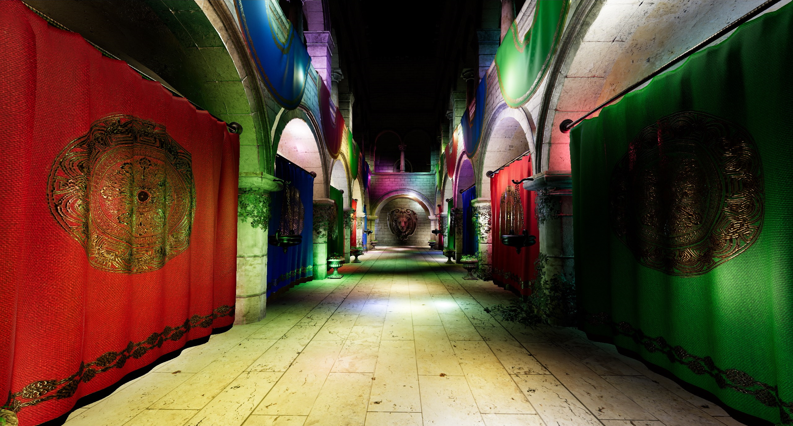

# Cluster

Implementation of [Clustered Shading](https://efficientshading.com/wp-content/uploads/clustered_shading_preprint.pdf) and Physically Based Rendering with the [bgfx](https://bkaradzic.github.io/bgfx/overview.html) rendering library.




The code is programmed to support bgfx's OpenGL and DirectX 11/12 backends. I've only tested it on one Windows 10 machine with an Nvidia GTX 1070, however. Other hardware or operating systems might have subtle bugs I'm not aware of.

## Functionality

### Live-switchable render paths

- forward, deferred and clustered shading
- output should be near-identical (as long as you don't hit the maximum light count per cluster)

### Clustered Forward Shading

- [logarithmical depth partition](http://advances.realtimerendering.com/s2016/Siggraph2016_idTech6.pdf)
- compute shader for cluster generation
- compute shader for light culling
    - AABB test for point lights
- cluster light count visualization

### Deferred Shading

- compact G-Buffer with 3 render targets
    - stores diffuse RGB, normal, F0 RGB, metallic, roughness
- light culling with light geometry
    - axis-aligned bounding box
    - backface rendering with reversed depth test
    - fragment world position reconstructed from geometry pass depth
- final forward pass for transparent meshes

### Forward Shading

Very simple implementation, might be useful to start reading the code

### Physically Based Rendering (PBR)

- [metallic + roughness](https://github.com/KhronosGroup/glTF/tree/master/specification/2.0#metallic-roughness-material) material support
- tangent space normal mapping
- Cook-Torrance microfacet specular BRDF
    - [GGX](https://www.cs.cornell.edu/~srm/publications/EGSR07-btdf.pdf) normal distribution function
    - Smith-GGX geometric shadowing function
- Lambertian diffuse BRDF
- [specular antialiasing](http://www.jp.square-enix.com/tech/library/pdf/ImprovedGeometricSpecularAA.pdf)
- windowed light attenuation

### Tonemapping

HDR tonemapping postprocessing with different operators:

- exponential
- simple [Reinhard](http://www.cs.utah.edu/~reinhard/cdrom/tonemap.pdf)
- Reinhard ([luminance only](https://imdoingitwrong.wordpress.com/2010/08/19/why-reinhard-desaturates-my-blacks-3/))
- [Uncharted 2](https://www.slideshare.net/ozlael/hable-john-uncharted2-hdr-lighting) 
- [H.P. Duiker filmic curve](https://www.slideshare.net/hpduiker/filmic-tonemapping-for-realtime-rendering-siggraph-2010-color-course)
- [ACES](https://github.com/TheRealMJP/BakingLab/blob/master/BakingLab/ACES.hlsl)
- ACES ([luminance only](https://knarkowicz.wordpress.com/2016/01/06/aces-filmic-tone-mapping-curve/))

## References

A few useful resources that helped with the implementation:

- Clustered Shading:
    - [A Primer On Efficient Rendering Algorithms & Clustered Shading](http://www.aortiz.me/2018/12/21/CG.html) by Angel Ortiz
    - [Practical Clustered Shading](https://newq.net/dl/pub/s2015_practical.pdf) by Emil Persson
    - [The devil is in the details: idTech 666](http://advances.realtimerendering.com/s2016/Siggraph2016_idTech6.pdf) by Tiago Sousa und Jean Geffroy
- Physically Based Rendering:
    - [Physically Based Rendering in Filament](https://google.github.io/filament/Filament.md.html) by Romain Guy and Mathias Agopian
    - [Real Shading in Unreal Engine 4](https://blog.selfshadow.com/publications/s2013-shading-course/karis/s2013_pbs_epic_notes_v2.pdf) by Brian Karis
    - [Moving Frostbite to Physically Based Rendering](https://seblagarde.files.wordpress.com/2015/07/course_notes_moving_frostbite_to_pbr_v32.pdf) by Sébastien Lagarde and Charles de Rousiers
- Tonemapping:
    - [Filmic Tonemapping Operators](http://filmicworlds.com/blog/filmic-tonemapping-operators/) by John Hable

## Compilation

Recent [CMake](https://cmake.org/) version (>= 3.13) required.

1. Generate project files:
   ```bash
   mkdir build
   cd build
   # e.g. VS 2019, compile for x64 platform
   cmake -G "Visual Studio 16 2019" -A x64 ..
   cd ..
   ```

2. Build. Open the project files with your IDE/build tool, or use CMake:
   ```
   cmake --build build/ --parallel --config Release
   ```

You can also grab a compiled copy for Windows with the Sponza model from the [Releases](https://github.com/pezcode/Cluster/releases) page.

## Libraries

- [bigg](https://github.com/JoshuaBrookover/bigg) ([bgfx](https://bkaradzic.github.io/bgfx/overview.html) + [dear imgui](https://github.com/ocornut/imgui) + [glfw](https://www.glfw.org) + [glm](https://glm.g-truc.net)) for UI and rendering
- [IconFontCppHeaders](https://github.com/juliettef/IconFontCppHeaders) for icon font support
- [assimp](http://www.assimp.org/) for model import
- [spdlog](https://github.com/gabime/spdlog) for logging

## Assets

- [Sponza](https://github.com/KhronosGroup/glTF-Sample-Models/tree/master/2.0/Sponza) model
- [Roboto](https://fonts.google.com/specimen/Roboto) font
- [Fork Awesome](https://forkaweso.me/Fork-Awesome/) icon font

## License

This software is licensed under the [MIT License](https://choosealicense.com/licenses/mit). Basically, you can do whatever you want with it, as long as you don't remove the license and copyright notice from relevant pieces of code.
